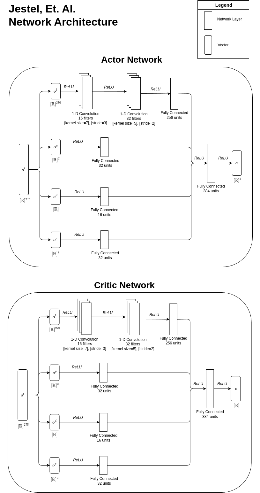

# RL Agents

This directory contains single file agent implementations. Each implementation 
includes a set of observation ranges and a neural network architecture.

## Default Agent
This agent was branched from the CleanRL continuous PPO example and has a single
dense layer for the actor and critic networks.

## Jestel Agent
This agent was implemented from the descriptions found in "Obtaining Robust 
Control and Navigation Policies for Multi-robot Navigation via Deep 
Reinforcement Learning" (Jestel, et. al.).

  

